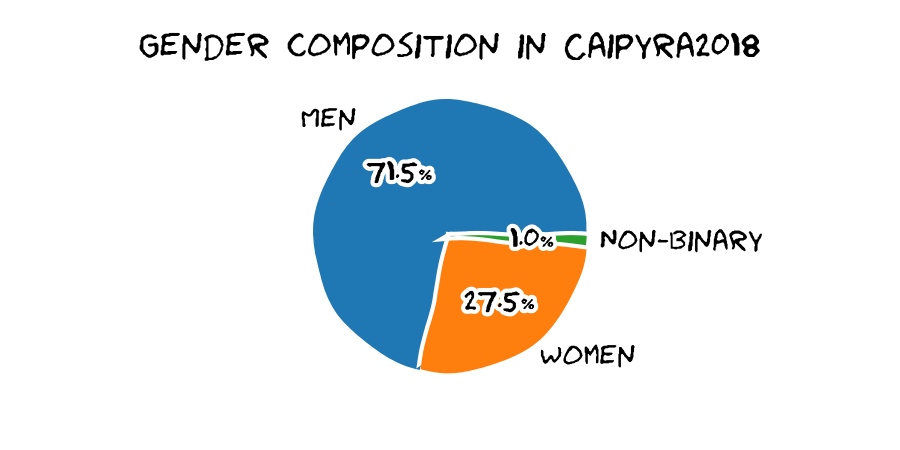
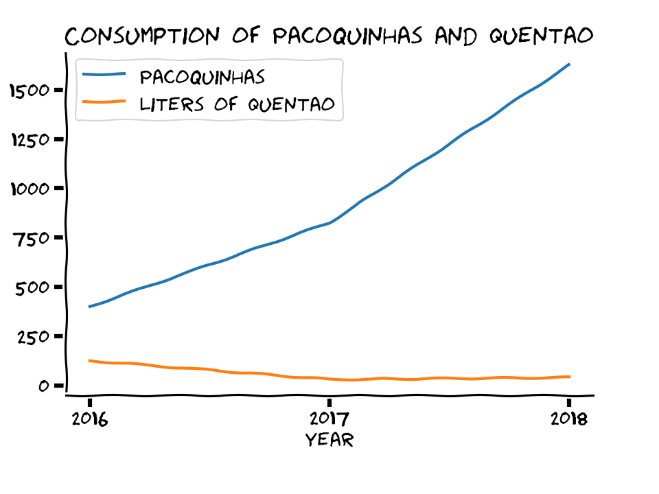
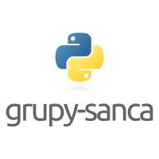

# Caipyra 2018

_[Click here](#caipyra-2018---public-report) for a version in English of this
report (or scroll down)._

O único evento de Python com Quentão e Paçoquinha!

8 a 11 de Junho de 2018 — São Carlos / SP

O Caipyra é um evento inspirado na [Python Brasil](https://pythonbrasil.org.br/)
(maior evento Python da América Latina) e visa, sem fins lucrativos, disseminar
conhecimento sobre diversas áreas da tecnologia.

Como o próprio nome já diz, o Caipyra, é um encontro organizado pela
comunidade Python do interior de São Paulo, para pessoas interessadas em
conhecer ou se aprofundar nesta linguagem, porém aberto a diversas
tecnologias que são trazidas e abordadas pelos nossos ilustres convidados.

O evento está na sua terceira edição e será realizado na cidade São
Carlos - São Paulo, no
[Instituto de Ciências Matemáticas e de Computação](https://icmc.usp.br/) na
[Universidade de São Paulo (USP)](https://www.usp.br/).

O evento está sempre crescendo:

É um evento inclusivo:

E o segredo de sempre melhorar é esse:

O evento custou cerca de 22 mil reais, gastos assim:

Nosso eventou contou com uma
[trilha sonora fantástica!](https://www.youtube.com/watch?v=EiXFGW75D-8&list=PL0GC85adzsKqVFXGKntt-KB5dHskW5Gp7)

## Django Girls

[Django Girls](https://djangogirls.org/) é uma organização internacional, sem fins lucrativos, que visa apresentar mulheres ao mundo da Tecnologia da Informação, ensinando-lhes a construir seu primeiro _website_ através de tutoriais organizados por voluntárias. Esse _website_ é construído em HTML, CSS, Python e Django. _Django_ é um _framework open source_, escrito em Python, para aplicações web. O único pré-requisito para a participação é de interesse! Todo o conhecimento necessário seguir o tutorial é apresentado em seu decorrer.

Na sexta-feira 08/junho tivemos um tutorial do _Django Girls_. Contamos com dezoito participantes, seis treinadores, e seis horas de duração. As participantes eram, em geral, jovens estudantes universitárias, dos mais variados cursos, graus acadêmicos e níveis de conhecimento de programação. O ambiente amigável e descontraído permitiu que as participantes se sentissem à vontade para expressar suas dúvidas e, assim, progredir rapidamente. Muitas estavam programando pela primeira vez na vida!! Elas pareciam muito entusiasmadas e satisfeitas com os resultados obtidos e conhecimentos adquiridos.

## Tutoriais
Tivemos dois tutoriais na sexta-feira, 8 de junho, relacionados à linguagem. De manhã o tutorial *Testes Unitários com Python* com a Patrícia Morimoto, que ensinou os primeiros passos para começar a fazer testes unitários usando Python, para garantir entregas de software funcionais com qualidade e de fácil manutenção. 

## Palestras

Tivemos 16 palestras nesta edição do evento, distribuídas em dois
auditórios durante dois dias:

- Sábado
  - Jadson Oliveira - Indicadores Inteligentes para Detecção de Epidemias de Dengue através do monitoramento de Redes Sociais em Tempo Real
  - Krissia Zawadzki - Hey físicas e físicos! Vocês têm um minutinho para ouvir a Pylavra da serpente quântica?
  - Prof. Dr. Rodrigo Fernandes de Mello
  - Beatriz Uezu - Visualizando query SQL a partir do ORM Django
  - Caroline Dantas - Computação Neuromórfica - O que é isso??? Como se usa Python Nisso??
  - Guilherme Vierno - Microservices em Python: desafios e soluções
  - Geraldo Barros - Internet Health Report:  Cinco tópicos-chave determinarão o futuro da Saúde da Internet
  - Prof. Dr. Paulo Matias - Hackeando a urna eletrônica brasileira com o Python
- Domingo
  - Juliana Oliveira - Processamento Paralelo para Pythonistas
  - Renne Rocha - Extraindo dados da internet usando Scrapy
  - Nilton Kazuyuki Ueda - [BI & Analytics] Data Visualization in Tableau with TabPy
  - João Rafael Martins - Introdução ao Machine Learning e NLP
  - Danilo Roberto Shiga - Exceptions: e porque não são só para erros
  - Eduardo Cuducos - Tecnologia cívica: o que importa são as perguntas!
  - Vitoria Ongaratto Baldan - Python na Astronomia
  - Osvaldo Santana - Como funciona um time remoto de desenvolvimento

Os slides estão disponíveis [aqui](#slides).

## Lightning Talks

_Lightning talk_ é uma palestra bem curta, de no máximo 5 minutos. As
submissões são feitas na hora, e _qualquer_ pessoa pode submeter! Não há restrições
quanto ao tema. Quando o cronômetro indica 5 minutos, o palestrante é aplaudido
e o próximo entra :D

Esses foram os _lightning talkistas_ e os temas deste ano:

- Sábado - Tarde
  - Osvaldo Santana - Advanced brain f*ck
  - Vinicius Mesel - Pyjobs
  - Renne Rocha - Flask Conf
  - Fabricio - Scutlle butt
  - Mario gazziro - Urna eletrônica de 3ª geração
  - Gabriel Palma - Python aplicado a biologia
  - Lucas Vido - Garoa Hacker Club
- Domingo - Manhã
  - Silas Moura - Anaconda
  - Jairo - Shadow cliff para imagens geográficos
  - Cuducos
  - Orlando Saraiva - Python nas faculdades
  - Patrícia Morimoto - Pyladies são Paulo e da SciELO
- Domingo - Tarde
  - Marcelo Miky - Café
  - Mawqee - bibliotequinhas
  - Murilo Viana - Watson ou paçoquinha
  - Ericles Lima - Péricles e Agesilaus
  - Rafael Beraldo - Grupos da região
  - Matheus - Hacker Space
  - Pedro - Padrim
  - Tania - Oi
  - Osvaldo - bugs no CPython

Alguns slides estão disponíveis [aqui](#lightning-talks-2)

## Sprints

## Espaço infantil

## Agradecimentos

- Buffet Carmen Garcia - Coffee-Break

- Magnum VIP - Gravação

- Equipe do Jhonatan - Fotografia

- Grokmaker - Espaço infantil

### Apoio

&nbsp;&nbsp;&nbsp;&nbsp;&nbsp;&nbsp;&nbsp;&nbsp;

&nbsp;&nbsp;&nbsp;&nbsp;

### Patrocinadores

&nbsp;&nbsp;

&nbsp;&nbsp;&nbsp;&nbsp;&nbsp;&nbsp;&nbsp;&nbsp;

## O Time

O Caipyra 2018 foi organizado pelo [grupy-sanca](http://www.grupysanca.com.br)!

O grupy-sanca (Grupo de Usuários Python de São Carlos) é uma comunidade que reúne pessoas interessadas em desenvolvimento de software e na linguagem Python. Prezamos pela troca de conhecimento, respeito mútuo e diversidade (tanto de opinião quanto de tecnologias).

Somos um grupo da cidade de São Carlos (SP) e região. O grupo foi fundado em 28/06/2016 e desde então já tivemos:

- 18+ Coding Dojos
- 20+ PyBares
- 16+ Cursos e workshops
- 6 PyLestras
- 3 Eventos
- 2 Sprints

Além disso, chegamos nos 961+ inscritos no Meetup!

Para saber mais sobre os eventos organizados pelo grupy-sanca acesse:

- [Site oficial](http://www.grupysanca.com.br)
- [Facebook](https://facebook.com/grupysanca)
- [Meetup](https://www.meetup.com/grupy-sanca)
- [Telegram](https://t.me/grupysanca)

# Caipyra 2018 - Public Report

The only Python event with
[Quentão](https://en.wikipedia.org/wiki/Cocktails_with_cachaça#Quentão_(Hot_Stuff))
and [Paçoquinha](https://en.wikipedia.org/wiki/Paçoca)!

[Event soundtrack](https://www.youtube.com/watch?v=EiXFGW75D-8&list=PL0GC85adzsKqVFXGKntt-KB5dHskW5Gp7)

## Django Girls

## Talks

## Lightning Talks

## The little Caipyras :)

## Acknowledgments

- Buffet Carmen Garcia - Coffee-Break

- Magnum VIP - Filming

- Equipe do Jhonatan - Photography

- Grokmaker - Kids space

### Support

### Sponsors

## The Team

# Slides

### Keynotes

- [Prof. Dr. Rodrigo Mello](../palestras/Keynote-Mello.pdf)
- [Prof. Dr. Paulo Matias](../palestras/keynote-PauloMatias.pdf)
- [Juliana Oliveira](../palestras/keynote-JulianaOliveira.pdf)
- [Osvaldo Santana](../palestras/keynote-OsvaldoSantana.pdf)

### Palestras

- [Jadson J. M. Oliveira](../palestras/Jadson.pdf)
- [Krissia Zawadzki](../palestras/Krissia.pdf)
- [Beatriz Uezu](../palestras/BeatrizUezu.pdf)
- [Caroline Dantas](../palestras/CarolineDantas.pdf)
- [Guilherme Vierno](../palestras/GuilhermeVierno.pdf)
- [Geraldo Barros](../palestras/GeraldoBarros.pdf)
- [Renne Rocha](../palestras/RenneRocha.pdf)
- [Nilton Kazuyuki Ueda](../palestras/NiltonUeda.pdf)
- [João Rafael Martins](../palestras/JoaoRafael.pdf)
- [Danilo Roberto Shiga](../palestras/DaniloShiga.pdf)
- [Eduardo Cuducos](../palestras/Cuducos.pdf)
- [Vitória O. Baldan](../palestras/VitoriaBaldan.pdf)

### Lightning Talks

- Sábado - Tarde
  - [Osvaldo Santana](../LightningTalks/OsvaldoSantana-BrainFck.pdf)
  - [Mario Gazziro](../LightningTalks/MarioGazziro.pdf)
- Domingo - Manhã
- Domingo - Tarde
  - [Marcelo Miky](../LightningTalks/Miky.pdf)
  - [Rafael Beraldo](../LightningTalks/Beraldo.pdf)
  - [Osvaldo Santana](../LightningTalks/OsvaldoSantana-Bugs.pdf)
